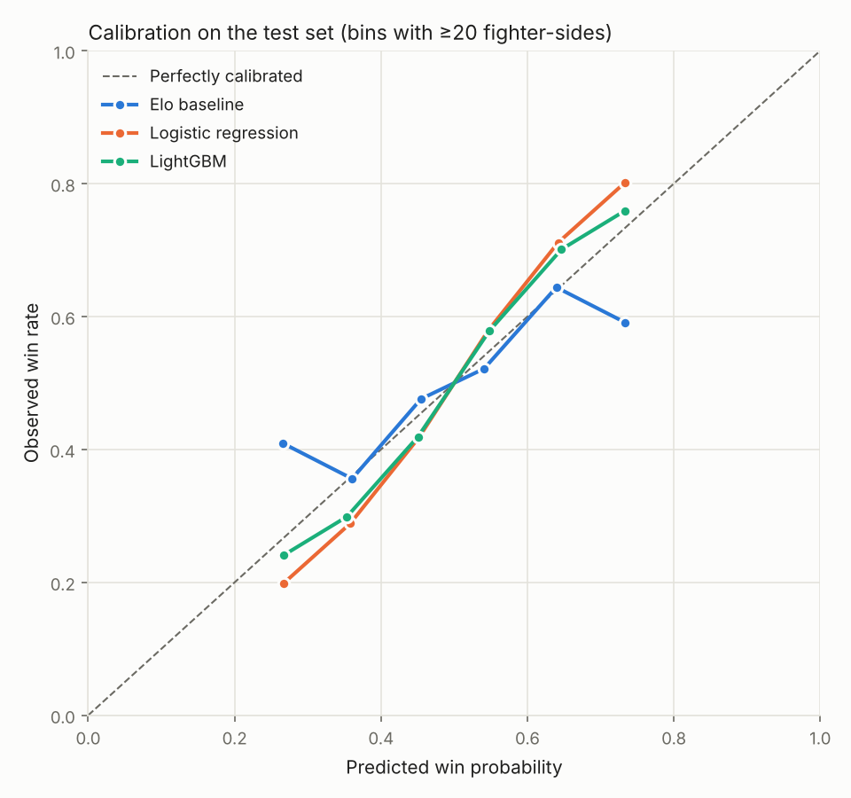
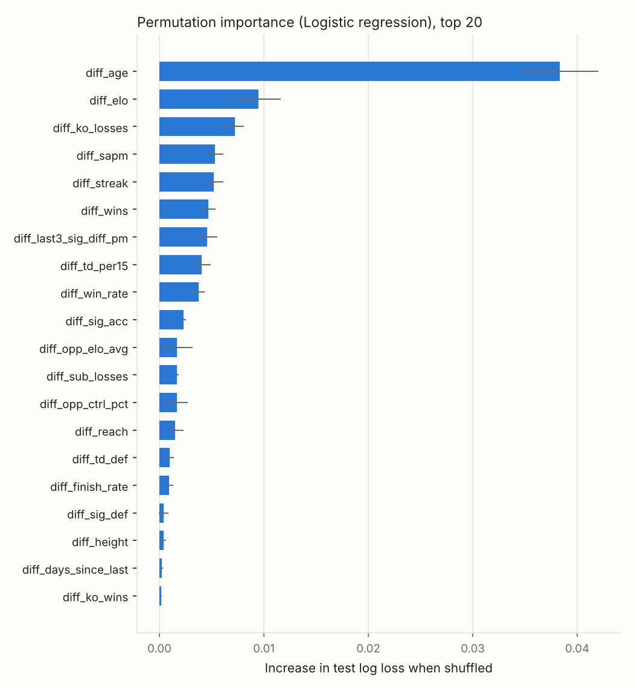
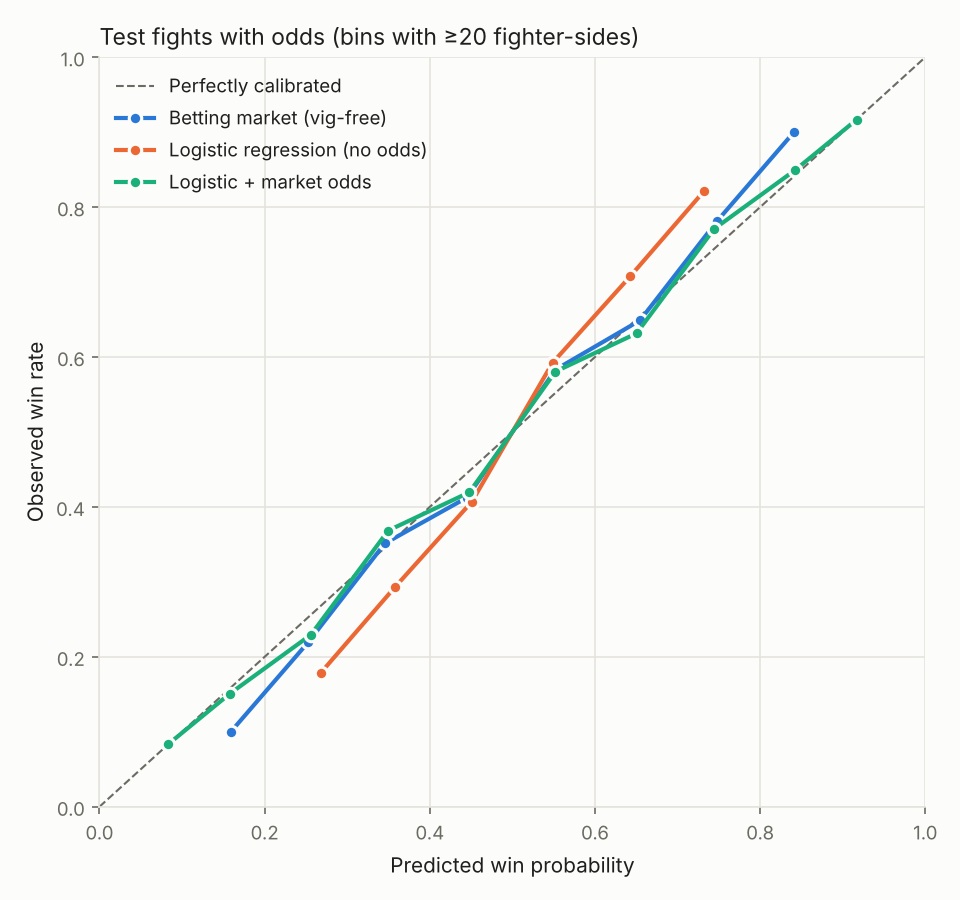

# UFC Fight Predictor

Predicts the winner of UFC fights as a calibrated probability, plus how the
fight ends (KO/TKO, submission or decision). It uses leak-free, pre-fight
features built on historical ufcstats.com data, with Dana White's Contender
Series results as extra history. Historical betting odds serve as a benchmark
and as an optional input.

```
$ python predict.py "Islam Makhachev" "Ilia Topuria" --five-rounds --title

Islam Makhachev vs Ilia Topuria  (Welterweight, 5 rounds, title fight)
model: Logistic regression (trained through 2026-10-03)

  Islam Makhachev   75.9%   [UFC 18-1, Elo 2063]
  Ilia Topuria      24.1%   [UFC 9-1, Elo 1856]

Method of victory:
  Islam Makhachev  KO/TKO 17.7%   SUB 21.0%   DEC 37.3%
  Ilia Topuria     KO/TKO 14.0%   SUB  2.3%   DEC  7.8%

Top factors (log-odds contribution):
  Current streak                     17 vs -1             +0.659 -> favors Islam Makhachev
  Elo rating                         2062.92 vs 1856.35   +0.617 -> favors Islam Makhachev
  Age                                34.95 vs 29.71       -0.309 -> favors Ilia Topuria
  ...
```

## Setup

```bash
cd ufc-predictor
pip install -r requirements.txt
```

## Pipeline

| Step | Command | Output |
|---|---|---|
| 1a. Scrape ufcstats.com | `python scrape.py` | `data/fights.csv`, `data/fighters.csv` |
| 1b. *or* import the GitHub mirror | `python import_mirror.py` | same files, same schema |
| 1c. Contender Series results (optional) | `python scrape_dwcs.py` | `data/dwcs_fights.csv` |
| 1d. Betting odds (optional) | `python import_odds.py` | `data/odds.csv` |
| 2. Features (optional, for inspection) | `python features.py` | `data/features.csv` |
| 3. Train and evaluate | `python train.py` | `models/model.joblib`, `reports/` |
| 4. Predict | `python predict.py "A" "B" [--five-rounds] [--title] [--weight-class W] [--odds ML_A ML_B]` | stdout |
| Tests | `python -m pytest -q` | |

### 1. Data

**`scrape.py`** crawls every completed event, every fight on each event, and
every fighter profile on ufcstats.com. It uses a shared `requests` session with
retries and backoff, and waits 0.75 s between requests (`--delay`).

- **Incremental:** events already in `fights.csv` and fighters already in
  `fighters.csv` are skipped. Results are appended after each event, so an
  interrupted run can just be restarted.
- **Per-fight stats:** totals per fighter (KD, sig/total strikes, TD, sub
  attempts, reversals, control time, and sig strikes by head/body/leg and
  distance/clinch/ground). `--` is stored as NaN, not 0.
- **Fighter profiles:** only height, weight, reach, stance and DOB are saved.
  The career summary stats (SLpM, Str. Acc., …) are ignored because they describe
  the fighter's *current* career and would leak future information.
- A full first run is roughly 9k fight pages plus 2.6k fighter pages, about 2.5
  hours at the default delay.

**`import_mirror.py`** builds the same files from
[Greco1899/scrape_ufc_stats](https://github.com/Greco1899/scrape_ufc_stats),
a regularly updated CSV mirror of ufcstats. Use it when ufcstats.com is
unreachable (it was blocked in the cloud sandbox this was built in). It runs in
a few seconds. It handles these mirror quirks:

- Stats are per round, so they are summed per fight (all-missing stays NaN).
- 25 fights appear twice under renamed events, so they are de-duplicated by
  fight URL.
- Bouts list names, not URLs, so names are matched to profiles accent- and
  case-insensitively. Shared names (e.g. two "Bruno Silva"s) are resolved by the
  profile weight closest to the bout's division.

**`scrape_dwcs.py`** parses DWCS season pages from Wikipedia. ufcstats doesn't
cover DWCS, and no public source has DWCS strike or takedown stats, so this
collects results only (date, division, fighters, winner, method, round, time).
`--html-dir` parses saved pages offline.

**`import_odds.py`** attaches odds from `ufc-master.csv`
([shortlikeafox/ultimate_ufc_dataset](https://github.com/shortlikeafox/ultimate_ufc_dataset)):

- **Coverage:** moneylines for 2010-03 → 2026-03, plus "wins by KO/TKO,
  submission or decision" prop odds for about 80% of those fights.
- **Odds only:** that dataset's career-stat columns are cumulative snapshots
  and could leak, so they are ignored.
- **Matching:** rows are matched to fights by date (±1 day) and fighter names,
  including nickname variants such as "Costas" vs "Constantinos" Philippou.
  7,165 of 7,177 rows match.
- **Processing:** odds are re-oriented to each fight's a/b order, and the
  bookmaker margin is removed by normalising the implied probabilities.
- **Caveat:** the dataset doesn't say whether these are opening or closing
  lines.

> ⚠️ Wikipedia was unreachable from the build sandbox, so the DWCS parser has
> only been tested against a hand-written fixture of Wikipedia's standard MMA
> results table. On a first real run, check the logged bout counts per season
> (DWCS seasons have about 40–50 bouts) and the "dropping N bouts with no
> parsable date" warning.

### 2. Features (`features.py`)

**No leakage, by construction.** `FeatureBuilder` replays all bouts
chronologically, one date at a time:

1. compute features for every fight on that date from the current state;
2. only then fold that date's results into each fighter's running aggregates and
   Elo.

A fight therefore never sees its own result or anything later, including
same-night tournament bouts from the early UFC events. `tests/test_features.py`
checks this directly. It scrambles every result and stat on or after a cutoff
date and asserts that all features up to and including the cutoff are
unchanged. It runs on synthetic data, on DWCS data, and on the real dataset
when present. I also confirmed the test fails if the two steps are swapped.

Per-fighter pre-fight features (the model sees `A − B` for each):

| Group | Features |
|---|---|
| Experience | UFC fights, wins, losses, smoothed win rate, DWCS bouts and wins |
| Striking | sig. landed/min, absorbed/min, accuracy, defense, KD/15 min, head/body/leg and distance/clinch/ground shares |
| Grappling | TD/15 min, TD accuracy, TD defense, sub attempts/15 min, control %, time controlled by opponents % |
| Finishing / durability | KO wins, sub wins, finish rate, KO/TKO losses, sub losses, decision rate |
| Form | win rate over last 3, current streak, sig-strike differential/min over last 3 |
| Activity | days since last fight |
| Physical | age on fight day, height, reach, southpaw, plus a southpaw-vs-orthodox matchup flag |
| Weight class | change vs the fighter's previous division (lbs; + = moving up; NaN for catchweight) |
| Rating | Elo (pre-fight, K=80, tuned on pre-2024 fights), average opponent Elo |
| Context | five-round fight, title fight, division limit (lbs), women's division |

Per-minute rates use only minutes from fights with recorded stats.

**DWCS history:** DWCS bouts update Elo, streak, form, layoff, finishes and the
DWCS record. They do not count toward UFC fight counts or any per-minute rate,
and they are never training rows. DWCS fighters are mapped to their ufcstats
profile by name, so a prospect's record carries into their UFC debut.

**Winner-first bias:** ufcstats lists the winner first in about 64% of fights.
Every model trains on both orientations (A vs B, plus B vs A with the features
negated and the label flipped). Every prediction averages `P(A wins)` with
`1 − P(B wins)`, so swapping corners always gives exactly the complementary
probability (this is asserted in `train.py` and in the tests).

### 3. Modeling (`train.py`)

- **Split:** train on fights before 2024-01-01, test on fights from 2024-01-01
  on (`--test-start`). Training rows start in 2001 (`--min-train-date`), but all
  earlier fights still feed fighter history.
- **Tuning:** the logistic C and the number of LightGBM trees are picked on a
  2021–2023 validation block inside the training period. The test set is never
  used for tuning.
- **Selection and refit:** the best model by test log loss is refit on all
  labelled fights and saved.

Results on the 1,451 test fights (2024-01-13 → 2026-10-03):

| Model | Accuracy | Log loss | Brier |
|---|---|---|---|
| Elo baseline (higher Elo wins) | 56.1% | 0.681 | 0.244 |
| Logistic regression | 64.8% | **0.637** | **0.223** |
| LightGBM | 65.1% | 0.639 | 0.224 |



Both learned models are well calibrated through the middle and slightly
*under*-confident at the extremes. Logistic regression edges out LightGBM on
log loss, so it is the saved model.

Permutation importance on the test set
([csv](reports/feature_importance.csv)) ranks age difference far ahead of
everything else, then Elo, KO/TKO losses, streak, and strikes absorbed per
minute:



Weight-class moves turned out to carry no signal. Only 8% of bouts involve a
move, and fighters moving up or down win at 64–66%, the same as the base rate.
The feature ranks near the bottom.

#### Against the betting market

Odds cover 996 of the 1,451 test fights (2024-01 → 2026-03), so all models are
compared on that subset:

| Model | Accuracy | Log loss | Brier |
|---|---|---|---|
| Betting market (vig-free) | 69.7% | 0.582 | 0.199 |
| Logistic regression (stats only) | 65.9% | 0.632 | 0.221 |
| **Logistic + market odds** | **70.0%** | **0.579** | **0.198** |
| Elo baseline | 56.2% | 0.678 | 0.243 |

The stats-only model does not beat the market. Adding the market's log-odds as
a feature edges it slightly, but the gain (0.002 log loss) is too small to call
real. The odds model is trained only on fights with odds (2010+); `predict.py`
uses it when you pass `--odds`.



#### Method of victory

The method model predicts six outcomes (A or B, by KO/TKO, SUB or DEC). It is
trained on both corner orders, and its mirrored prediction has its classes
swapped before averaging. What `predict.py` shows is P(winner) from the winner
model × P(method | winner) from the method model. Results on the 1,448 decisive
test fights:

| Model | 6-way log loss | 6-way accuracy | Method-only accuracy |
|---|---|---|---|
| Method frequencies (baseline) | 1.712 | 27.0% | 49.5% |
| Winner model × multinomial logistic | 1.585 | 33.3% | 52.4% |
| **Winner model × LightGBM multiclass** (saved) | **1.581** | 33.5% | 51.9% |

The market's method props (935 test fights) are better still: log loss 1.539
vs 1.564 for our model on the same fights. Method is inherently hard to
predict; the most likely outcome is right only about a third of the time.

### 4. Prediction (`predict.py`)

- **Same pipeline as training:** it replays all known bouts through the same
  `FeatureBuilder` and treats the matchup as one more pending fight.
- **Name lookup:** names match accent- and case-insensitively, with fuzzy
  matching for typos. Shared names resolve to the most recently active profile,
  and the alternatives are printed. You can also pass a ufcstats profile URL or
  id.
- **Debuts and unknowns:** a fighter with no UFC fights (or not in the data at
  all) gets Elo 1500, a 0.5 smoothed win rate, and missing career rates. Their
  physicals and DWCS record are still used.
- **Weight class:** `--weight-class` sets the division. Without it, the
  fighters' most recent division is used (the heavier one if they differ).
- **Betting odds:** `--odds -150 +130` (A first, American odds) switches to the
  odds model.
- **Explanations:** the top factors are orientation-averaged log-odds
  contributions. Collinear record features are reported together as one
  "UFC record" factor.

## Project layout

```
ufc_common.py     schema, parsing helpers, name resolver
scrape.py         ufcstats.com scraper (incremental)
import_mirror.py  GitHub-mirror importer (same schema)
import_odds.py    historical betting odds -> data/odds.csv
scrape_dwcs.py    Contender Series results from Wikipedia
features.py       chronological, leak-free feature builder
models.py         orientation-symmetric Elo / logistic / LightGBM / 6-way method models
train.py          time-split evaluation, reports, final model
predict.py        CLI
tests/            fixtures, synthetic data, leakage + parser + prediction tests
```

## Known limitations

- **Missed weight and short-notice replacements** aren't modeled. ufcstats and
  both odds datasets lack them; the fight notes on Wikipedia event pages are
  the likeliest source.
- **Extreme values:** the logistic model extrapolates linearly. A 17-fight win
  streak, for example, gets a large boost even when the market disagrees.
